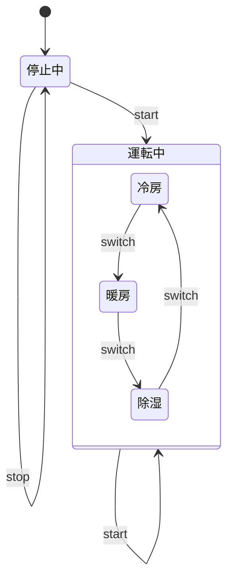
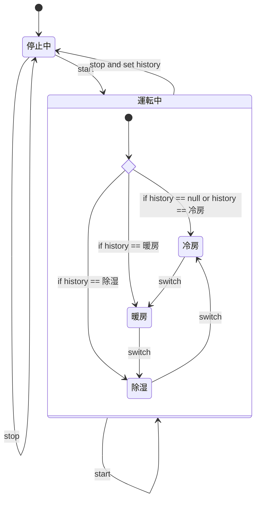
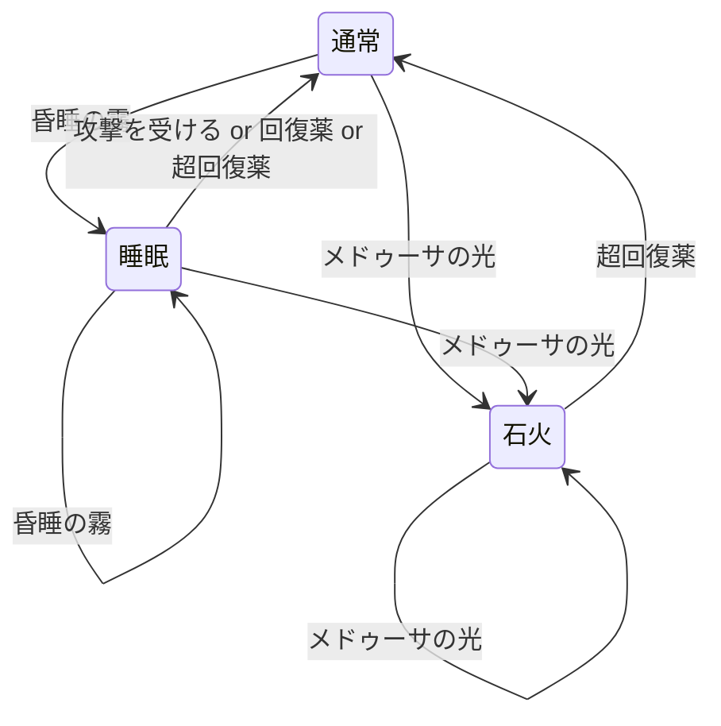

# 状態遷移テスト

## 状態遷移テストとは

## 具体例

### ストップウォッチ

状態遷移表

|                | 初期状態 | 計測中     | 一時停止中 |
| -------------- | -------- | ---------- | ---------- |
| スタートボタン | 計測中   | 一時停止中 | 計測中     |
| リセットボタン |          |            | 初期状態   |

### エアコン

状態遷移図（履歴を考慮しなかった場合）

状態遷移図（履歴を条件分岐で表現）

### BUG QUEST戦闘中のステータス

状態遷移図

状態遷移表

|                | 通常 | 睡眠 | 石火 |
| -------------- | ---- | ---- | ---- |
| 昏睡の霧       | 睡眠 | N/A  | N/A  |
| メドゥーサの光 | 石火 | 石火 | N/A  |
| 攻撃を受ける   | N/A  | 通常 | N/A  |
| 回復薬         | N/A  | 通常 | N/A  |
| 超回復薬       | N/A  | 通常 | 通常 |

テストケース

| 状態     | アクション             | 結果               |
| -------- | ---------------------- | ------------------ |
| 通常状態 | 昏睡の霧を受ける       | 睡眠状態になること |
| ^        | メドゥーサの光を受ける | 石火状態になること |
| ^        | 攻撃を受ける           | 変化しないこと     |
| ^        | 回復薬を使用する       | ^                  |
| ^        | 超回復薬を使用する     | ^                  |
| 睡眠状態 | 昏睡の霧を受ける       | 変化しないこと     |
| ^        | メドゥーサの光を受ける | 石火状態になること |
| ^        | 攻撃を受ける           | 通常状態になること |
| ^        | 回復薬を使用する       | ^                  |
| ^        | 超回復薬を使用する     | ^                  |
| 石火状態 | 昏睡の霧を受ける       | 変化しないこと     |
| ^        | メドゥーサの光を受ける | ^                  |
| ^        | 攻撃を受ける           | ^                  |
| ^        | 回復薬を使用する       | ^                  |
| ^        | 超回復薬を使用する     | 通常状態になること |
