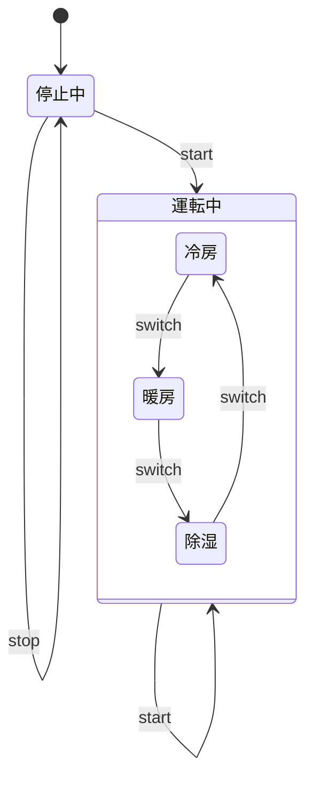
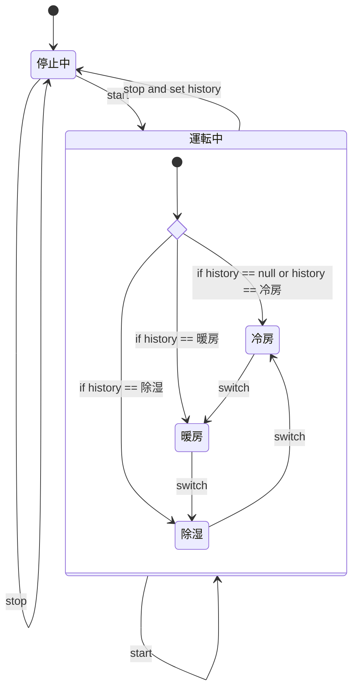

# 状態遷移テスト

## 状態遷移テストとは

## 具体例

### ストップウォッチ

#### 状態遷移表

|                | 初期状態 | 計測中     | 一時停止中 |
| -------------- | -------- | ---------- | ---------- |
| スタートボタン | 計測中   | 一時停止中 | 計測中     |
| リセットボタン |          |            | 初期状態   |

### エアコン

#### 状態遷移図

履歴を考慮しなかった場合

履歴を条件分岐で表現

